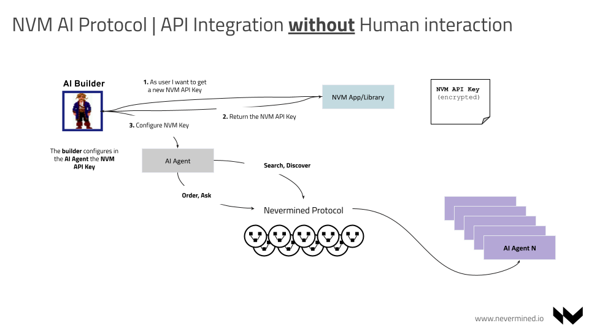

# AI Agents integration

Via the Nevermined Protocol agents can be integrated to be used by users or other applications. Once the user owns the plan giving access to an AI Agent, it is up to the user to decide how they want to integrate or use that agent. For example:

- Building a user interface that sends queries to the agent and return the answers provided
- Integrating the Agent in another AI Agent with a bigger purpose. So the second agent integrating the first one can decompose complex questions into smaller steps where some of these steps can be resolved by other AI.
- Use directly the AI Agent sending direct queries from a command line interface or similar.

## Integration with a Human in the loop

This scenario is the representation of a user who identifies an interesting AI Agent, purchases it and integrates the agent (via the Nevermined Library) in some software. The flow is as follows:

1. The user discovers an AI Agent via Nevermined App or Library
2. The user purchases the Payment Plan attached to it. The settlements for the payment and distribution are registered on-chain
3. The user gets an access key (JWT) granting access to the Payment Plan’s assets and services
4. The user configures the Access Token, Proxy and DID of the Agent in the software
5. Via the Nevermined Library (or standard HTTP requests) the software configured by the user requests the execution of a Task to the AI Agent through the Proxy
6. The Nevermined Proxy validates the request
7. If everything is right the Proxy forwards the request to the Upstream AI Agent
8. The Agent process the Task requested and returns the results

As described before, if the execution was correct Nevermined infrastructure will redeem the credits used to process the Task.

## AI Agent integration without Human in the loop

This scenario is more sophisticated and represents an autonomous agent that via the Nevermined Protocol discovers other agents and integrating them automatically without any user interaction. This scenario requires the AI Builder to create an AI Agent integrated via the Nevermined Library, sophisticated enough to perform the discovery process, purchase and query programmatically via that Library. The flow is as follows:

1. The AI Builder gets the Nevermined API Key from the Nevermined App. The user is able to configure certain permissions associated with the key
2. The App returns the Nevermined API Key to the AI Builder
3. The AI Builder configures the API Key in the Agent via Nevermined Library
4. Having the API Key configured the AI Agent can discover other agents, purchase access credits and query them without any human interaction

