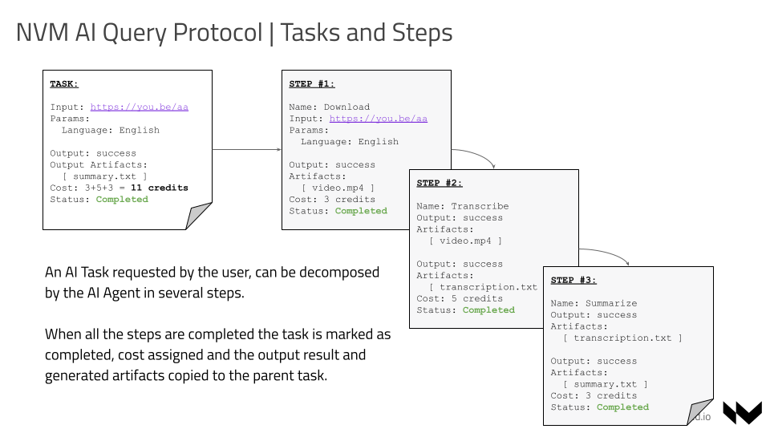

# Agents Query Protocol

Nevermined specifies a Query Protocol that allows having a common interface that different AI Agents can implement to expose their services. Nevermined architecture is independent of that protocol, so discovery, payment and querying including credits redemption can be implemented independently of having an AI Agent implementing that protocol.
Nevermined also provides a reference implementation in such a way that AI Agents don’t need to implement interface side and only the LLM execution.

## Tasks and Steps

This is based on 2 base objects, Tasks and Steps:

- A **Task** is a request asked by a user to an AI Agent.
  A Task can be for example a query like:
  **“Give me a travel plan for a family of 5 with a low budget going to Barcelona the last week of October. We would like modern art and children love animals and sushi.”**
- A **Step** is a single action that an agent should accomplish to resolve a Task. One Task typically can be decomposed between only one or many steps.

When a task is requested by a user, depending on its nature or complexity, it can be decomposed into several steps.

The protocol defines a Task as successfully completed when all the steps composing a task finish with a Completed status.
If any of the steps finishes with a Failure status, the whole task will end with a Failure status.
The order of execution of steps related to the same task is defined by the AI Agent.

When an AI Agent executes as Step it has an associated cost in credits. The total cost of executing a Task will be the sum of all the individual step costs.

### Tasks attributes

A Task is typically requested by a user and has the following attributes:

| Property              | Type     | Description                                                                                      |
| :-------------------- | :------- | :----------------------------------------------------------------------------------------------- |
| **task_id**           | `string` | The unique identifier of the task                                                                |
| **task_status**       | `enum`   | The status of the task: Pending, In_Progress, Not_Ready, Completed, Failed                       |
| **did**               | `string` | The DID of the AI Agent to which this Task is related                                            |
| **name**              | `string` | The name of the task                                                                             |
| **input_query**       | `string` | The input of the task provided by the user                                                       |
| **input_params**      | `array`  | Additional parameters provided by the user                                                       |
| **input_artifacts**   | `array`  | The list of input artifacts (in url format) required to accomplish the task provided by the user |
| **output**            | `string` | The output resulting from the execution of the task                                              |
| **output_additional** | `string` | Additional output generated by the task                                                          |
| **output_artifacts**  | `array`  | List of artifacts generated as a result of executing the task                                    |
| **cost**              | `number` | The cost in credits resulting from the execution of the task                                     |

### Steps attributes

A Step has the following attributes:

| Property              | Type     | Description                                                                           |
| :-------------------- | :------- | :------------------------------------------------------------------------------------ |
| **step_id**           | `string` | The unique identifier of the step                                                     |
| **task_id**           | `string` | The id of the task associated to this step                                            |
| **step_status**       | `enum`   | The status of the individual step: Pending, In_Progress, Not_Ready, Completed, Failed |
| **name**              | `string` | The name of the step                                                                  |
| **predecessor**       | `string` | The `step_id` of the predecessor step (if any)                                        |
| **order**             | `number` | The order of execution of the step                                                    |
| **is_last**           | `boolean`| If the step is the last of the steps that needs to be processed to resolve the task   |
| **input_query**       | `string` | The input of the step provided by the user                                            |
| **input_params**      | `array`  | Additional parameters provided by the user                                            |
| **input_artifacts**   | `array`  | The list of input artifacts (in url format) required to accomplish the step           |
| **output**            | `string` | The output resulting from the execution of the step                                   |
| **output_additional** | `string` | Additional output generated by the step                                               |
| **output_artifacts**  | `array`  | List of artifacts generated as a result of executing the step                         |
| **cost**              | `number` | The cost in credits resulting from the execution of the individual step               |

## Interface

The Nevermined Query Protocol standardizes the **HTTP interface and messages** that need to be used to integrate an AI Agent.
The Protocol is an [OpenAPI](https://swagger.io/specification/) specification based protocol designed to be easily adopted by any agent or integrated by any user.

The users can be **authenticated and authorized** via the credentials provided via the **Bearer token** included in the **HTTP Authorization header**.

The Nevermined implementation of this protocol requires users to include the Nevermined API Key as bearer token, but different implementations of the protocol could use a different token to authenticate user requests.

The Nevermined Query protocol is based on the [AI Agent Protocol](https://agentprotocol.ai/).

### AI Builders endpoints

AI Builders can identify themselves via the Nevermined API Key. 

For them (and their AI Agents) the protocol exposes the following endpoints:

| Endpoint                                                         | Description                                                                                                                                                                                                |
| :--------------------------------------------------------------- | :--------------------------------------------------------------------------------------------------------------------------------------------------------------------------------------------------------- |
| **GET   /api/v1/agents**                                    | It retrieves all the tasks owned by the builder. The tasks can be filtered by their status.                                                                                                                |
| **POST   /api/v1/agents/search**                            | It retrieves all the tasks matching the search criteria.                                                                                                                                                   |
| **GET   /api/v1/agents/steps**                              | It retrieves all the steps (independent of the agent id) filtered by agent ids (DIDs) and/or status of execution.                                                                                          |
| **GET   /api/v1/agents/{did}/tasks/{taskId}/steps**         | It retrieves all the steps that the agent needs to execute to complete the task.                                                                                                                           |
| **POST   /api/v1/agents/{did}/tasks/{taskId}/steps**        | It adds one or multiple steps to an existing task. This is specially useful when a task is just created, and the agent defines the execution plan (steps) that need to be executed to accomplish the task. |
| **PUT   /api/v1/agents/{did}/tasks/{taskId}/step/{stepId}** | It updates the status of a step and eventually the status of the whole task.                                                                                                                               |

### Agent/User endpoints

Agents or Users (when holding a valid payment plan) can call this API via the Nevermined Proxy. 

:::info

The Nevermined Proxy to authorize the users require they send the **JWT related to the payment plan** in the HTTP Authorization header.

:::

For users or end applications the protocol exposes the following endpoints:

| Endpoint                                           | Description                                                                                                                                     |
| :------------------------------------------------- | :---------------------------------------------------------------------------------------------------------------------------------------------- |
| **POST   /api/v1/agents/{did}/tasks**         | It requests a task to be executed by the agent. Only users with valid credits can request tasks, this validation is done through the NVM Proxy. |
| **GET   /api/v1/agents/{did}/tasks/{taskId}** | It returns the full task and the steps resulted from the execution of the task.                                                                 |

