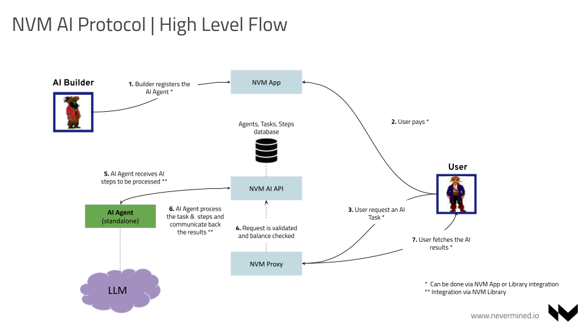
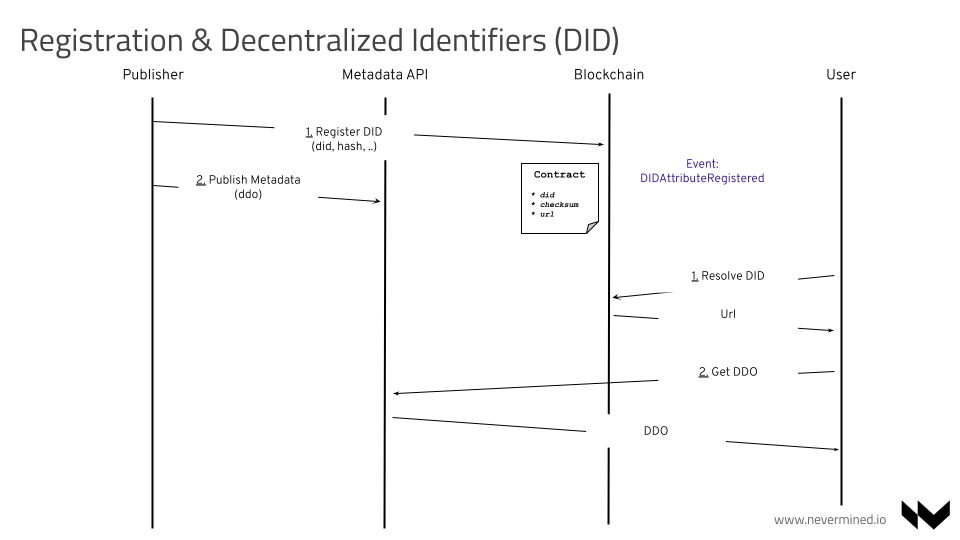

# User Flows

## High Level Flow

The Nevermined protocol allows the registration, payment and usage of AI Agents. The following flow describes the interaction between an AI builder managing an AI Agent and a final user:

1. The AI builder registers the AI Agent & Payment Plan via the Nevermined App or the NVM Library
2. A user (or AI Agent) discovers the AI Agent and purchases the Payment Plan attached to it (also via App or Library). When the user makes this payment it receives credits representing the Payment Plan in their wallet
3. The user makes a request to the AI Agent of a new Task. This Task is requested via a HTTP request sent to the AI Agent through the Nevermined Proxy
4. The Nevermined Proxy validates the user request and if everything is correct let’s it pass the request to the Nevermined AI API
5. The AI Agent subscribes for new Tasks. It picks up the Task requested from the user.
6. The AI Agent process the Task and Steps and reports back the results of the execution of the Task
7. The user fetches the AI results

If the request sent by the user was processed correctly, Nevermined infrastructure will redeem the credits used to process the Task.

## Registration

It allows the registration of assets (agents, models, payment plans, etc) in a Nevermined network. The registration happens directly from the Publisher and involves the following steps:

1. The publisher locally computes the DID using the Metadata and registers it on-chain in the DIDRegistry contract associated with the URL where the metadata will be stored
2. The publisher stores the metadata and any existing Metadata API implementation

Having a DID any user can resolve the metadata by having the DID query the DIDRegistry Smart Contract:

1. The user having the DID can get the full metadata url
2. Having the metadata url the user can fetch the complete metadata from the Metadata API

